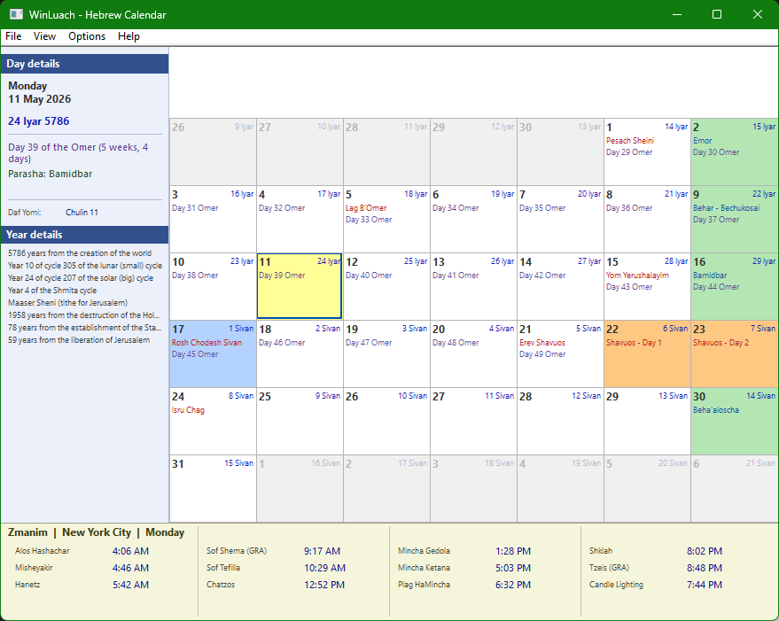

# WinLuach — Hebrew Calendar for Windows

A Hebrew/Gregorian calendar application for Windows, built in C++ (Win32).

## Features
- Monthly calendar view with Hebrew and Gregorian dates
- Color-coded holidays (Yom Tov, Shabbos, Rosh Chodesh, fast days)
- Full halachic times (zmanim) for any location worldwide
- Supports GRA and Magen Avraham shitot
- Parasha of the week (Ashkenazi tradition)
- Sfirat HaOmer count
- Daily learning: Daf Yomi, Yerushalmi, Mishna Yomit, Halacha Yomit, Tanach Yomi
- 120+ built-in world cities with custom location support
- Israel and Diaspora holiday schedules

## Status
Active development — v0.3.1

## Building
Open `WinLuach.sln` in Visual Studio 2022 or later.
Requires the Desktop Development with C++ workload.
No external dependencies.

## License
MIT
