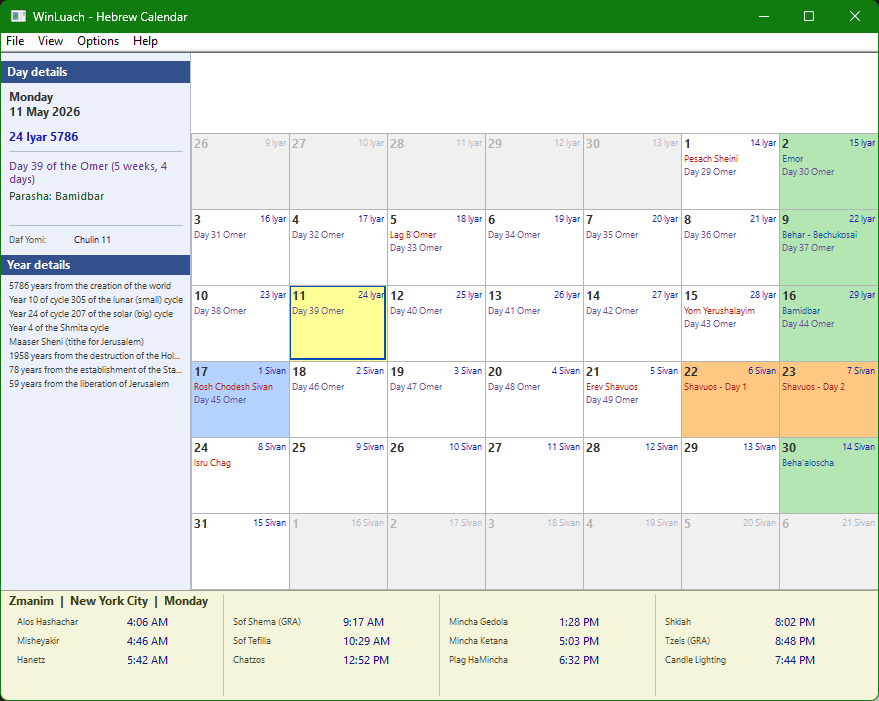

This is **vibe coded software**.

---

# WinLuach — Hebrew Calendar for Windows



A full-featured Hebrew calendar application for Windows with halachic zmanim, Jewish holidays, daily learning schedules, and a countdown clock.

## Features

- **Dual Calendar** — Gregorian and Hebrew dates displayed side by side in a color-coded monthly grid
- **Halachic Zmanim** — Sunrise/sunset (NOAA algorithm with elevation correction), alot, misheyakir, hanetz, sof zman shema/tefilla, chatzot, mincha gedola/ketana, plag, shkiah, tzeit. Supports GRA, Magen Avraham (72/90), and custom degree-based shitot
- **Jewish Holidays** — All holidays, Rosh Chodesh, Chol HaMoed, fast days, modern Israeli holidays, Yom Tov Sheni, Isru Chag
- **Parsha of the Week** — With Israel/Diaspora distinction for combined parshiyot
- **Sfirat HaOmer** — Day-by-day count with the day's phrase
- **Daily Learning** — Daf Yomi (Bavli & Yerushalmi), Mishna Yomit, Halacha Yomit, Tanach Yomi
- **Personal Events** — Birthdays, anniversaries, yahrzeits (Gregorian or Hebrew), custom events with reminders
- **Web Calendars** — Subscribe to iCal/ICS feeds
- **Reminders** — Rule-based notification system with zman-relative offsets
- **Countdown Clock** — Floating window counting down to the next zman or event. Launch with `/countdown`
- **Printing** — Monthly and yearly calendar views with customizable layout
- **Tray Icon** — Quick info and access from the system tray
- **Auto-Update** — One-click updates via GitHub Releases
- **Roaming Settings** — Configuration stored in `%OneDrive%\Documents\WinLuach\` for sync across devices

## Download

Grab the latest release from the [Releases page](https://github.com/akivacp/WinLuach/releases).

## Usage

Launch `WinLuach.exe` to open the main calendar window.

### Command-line arguments

| Argument | Action |
|----------|--------|
| *(none)* | Show the main calendar |
| `/countdown` | Open the countdown clock |
| `/options` | Open the preferences dialog |

These arguments also work from the Windows taskbar Jump List (right-click the icon).

## Building from source

### Prerequisites

- Visual Studio 2022 with the "Desktop development with C++" workload (MFC component)
- Windows 10 SDK (10.0.26100.0 or later)

### Build

```powershell
msbuild WinLuach.slnx /p:Configuration=Release /p:Platform=x64
```

The output binary is placed in `x64\Release\WinLuach.exe`.

Release builds also increment the build number — run `Build-Release.ps1` for a full signed release package.

## Settings

Settings are stored as JSON in `%OneDrive%\Documents\WinLuach\`, making them roamable across machines via OneDrive/Dropbox.

## License

MIT License. See [LICENSE](LICENSE) for details.
